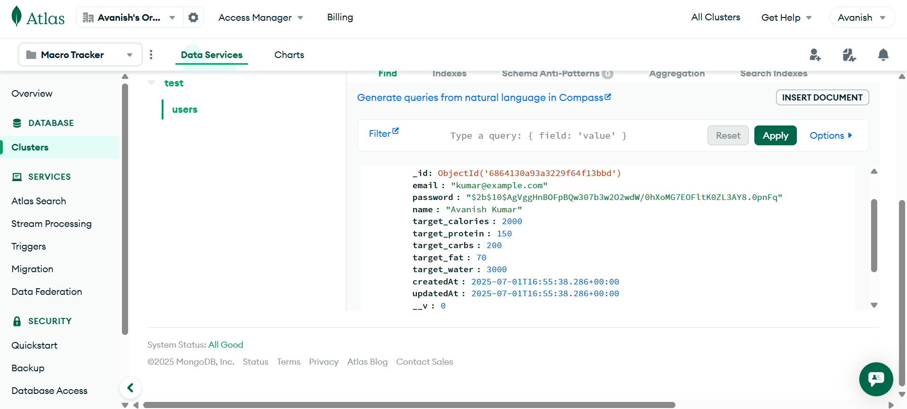
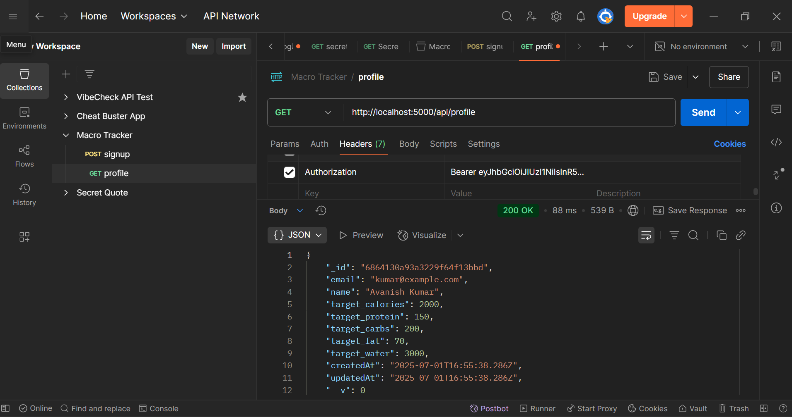
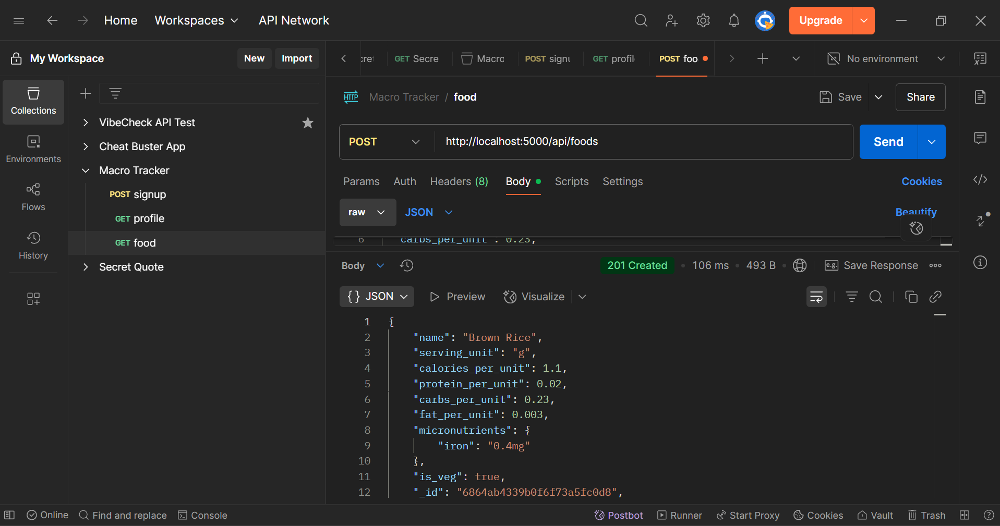
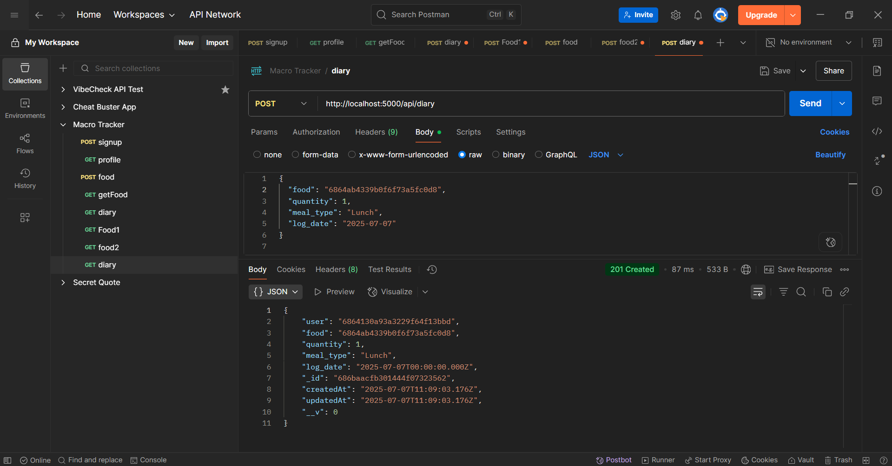
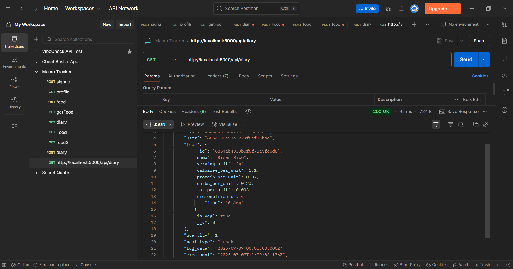
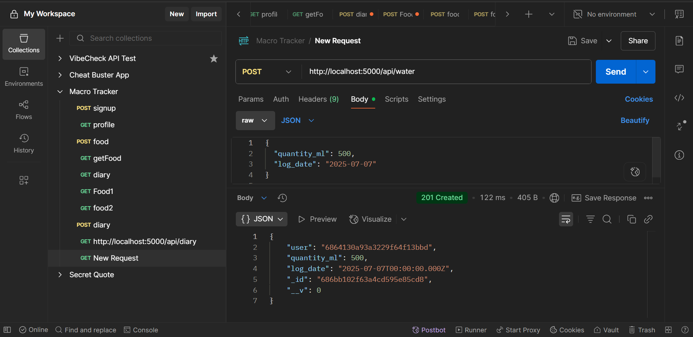
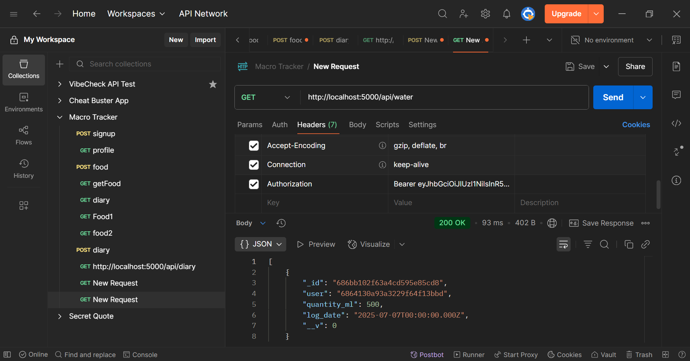
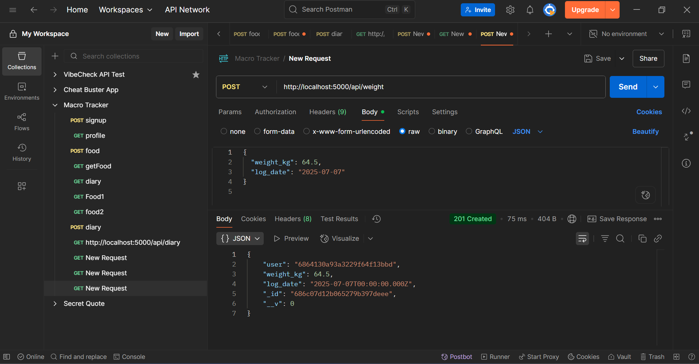
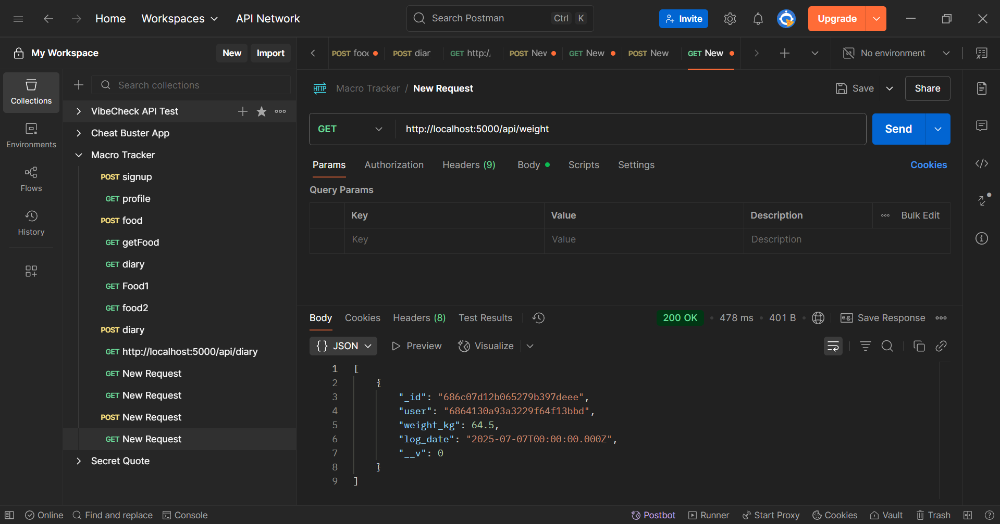
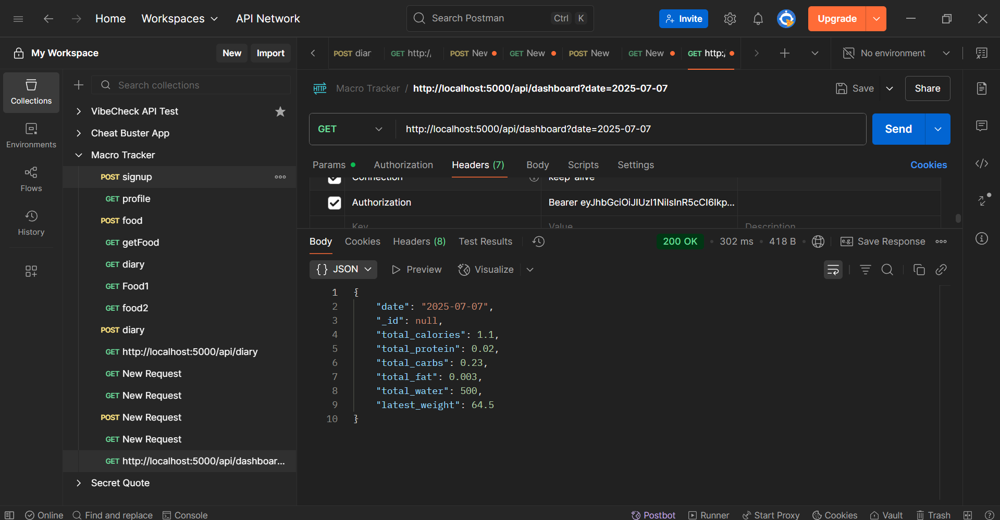

## Macro Tracker - Backend

A complete Node.js + Express.js + MongoDB backend project for tracking daily nutrition intake, water consumption, and weight, along with user authentication.

### Features Implemented

-  **User Authentication**
  - Secure registration and login with JWT
  - Passwords hashed using bcrypt

-  **Profile Management**
  - Set and update target calories, protein, carbs, fat, and water

-  **Food Diary**
  - Add food entries with meal type and quantity
  - Fetch all logged entries per user

-  **Water Tracking**
  - Log water intake by quantity and date
  - Retrieve all water logs for a user

-  **Weight Tracking**
  - Log body weight for specific dates
  - Fetch historical weight data

-  **Dashboard**
  - Aggregated view of total nutrients and logs for a given day

### Tech Stack

- **Runtime Environment:** Node.js
- **Web Framework:** Express.js
- **Database:** MongoDB (via Mongoose ODM)
- **Authentication:** JSON Web Tokens (JWT), bcryptjs
- **Environment Config:** dotenv
- **Testing Tools:** Postman
- **Dev Tools:** Nodemon

##Screenshots with Descriptions

1. User Registered

*Shows a successful registration response from the server after sending a valid request with name, email, and password.*

2. MongoDB User Document

*Demonstrates how the registered user is stored in MongoDB.*

3. Profile Endpoint

*Displays the response from the profile API showing user details and macro/water goals.*

4. Food Added to Database

*Illustrates a food item entry saved in the database.*

5. Food Diary Entry Created

*Shows the POST request to add a food item to the diary.*

6. Food Diary Entries Retrieved

*Displays all diary entries for the user retrieved from the database.*

7. Water Log Entry

*Shows the POST request to log water consumption.*

8. Water Logs Retrieved

*Displays the GET response for all logged water entries*

9. Weight Log Entry

*Illustrates how a weight value is logged for a particular date*

10. Weight Logs Retrieved

*Shows the fetched weight data entries for the user*

11. Dashboard Summary

*Displays a daily summary of total calories, macros, water, and weight from all logs*